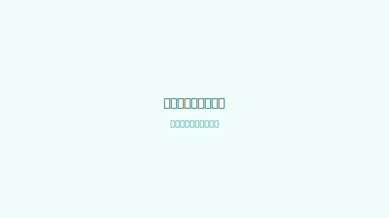
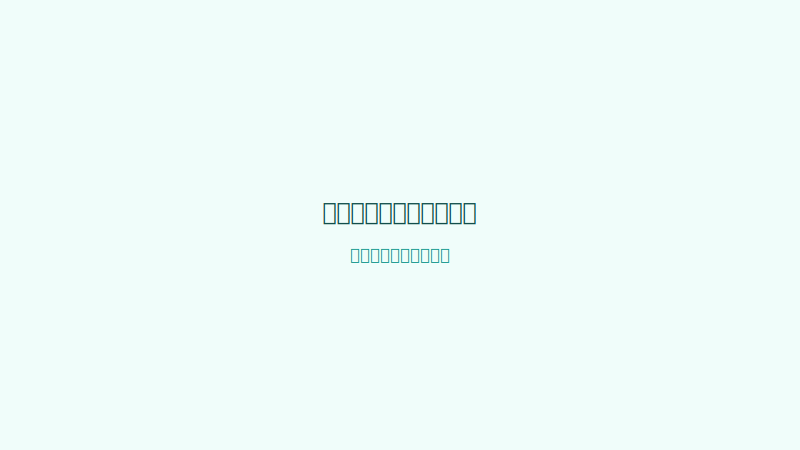

# CulturalBridge 使用手册

## 第 1 章 快速开始

### 1.1 登录与注册

打开 CulturalBridge 后，使用管理员分配的账号登录。首次登录后可在“账户”页面查看积分余额与个人信息。

### 1.2 界面概览

登录后进入主界面，顶部导航依次为：

- **工作台**：进行文化适配翻译。
- **审校**：对译文进行四维审校。
- **术语库**：管理系统知识库与自定义术语。
- **历史**：查看过往翻译任务。
- **管理**（仅管理员可见）：用户与积分管理。
- **使用手册**：打开本页面。


### 1.3 完成第一次翻译

1. 点击顶部 **工作台**。
2. 在左侧输入区粘贴中文原文，或点击上传按钮选择 `.txt` / `.docx` / `.pdf` 文件。
3. 选择文体、目标语言、文化圈与受众类型。
4. 点击 **开始翻译**。
5. 在右侧输出区查看译文、风险标注与决策日志。

## 第 2 章 内容编辑 / 译者指南

### 2.1 工作台翻译

#### 输入文本与文件上传

输入区支持直接粘贴文本或上传文件。上传后系统会自动提取文本并填入编辑器。目前支持的格式包括：

- `.txt`：纯文本文件
- `.docx`：Word 文档
- `.pdf`：PDF 文档

#### 选择文体、目标语言、文化圈、受众类型

翻译前需要配置以下参数：

| 参数 | 说明 | 示例 |
|---|---|---|
| 文体 | 原文所属文体类型 | 新闻稿、演讲稿、社论 |
| 目标语言 | 译文语言 | 英语（英国）、德语、法语 |
| 文化圈 | 目标受众所属文化圈 | 英美、西欧、东亚 |
| 受众类型 | 目标读者身份 | 普通公众、专业人士、政策研究者 |

#### 启动翻译与查看结果

参数配置完成后，点击 **开始翻译**。系统将依次执行文化预处理、术语检索、LLM 翻译、风险标注与替换建议，最终返回：

- 译文文本
- 内联风险标注
- 替换建议
- 转译决策日志

### 2.2 理解风险标注

风险标注以高亮形式出现在译文中，悬停可查看风险类型、说明与建议操作。



#### 风险类型与含义

常见风险类型包括：

- **文化负载词**：目标语读者可能缺乏文化背景理解的词汇。
- **政治隐喻**：涉及政治话语或意识形态的隐喻表达。
- **术语不一致**：与术语库推荐译法存在偏差。

#### 接受 / 忽略 / 回退操作

对于每个风险标注，你可以选择：

- **接受**：采纳系统建议的替换文本。
- **忽略**：保留当前译文，不再提示该风险。
- **回退**：撤销之前的接受/忽略操作，恢复原始译文。

也可以点击 **全部接受** 一键采纳所有建议。

### 2.3 高语境术语内联高亮

在输入区，系统会实时高亮两类高语境术语：

1. **术语库命中**：政治话语、文化隐喻等术语的字面匹配。
2. **LLM 文化负载词识别**：隐喻、政治话语等语义识别结果。

悬停高亮片段可查看分类、风险备注、推荐译法与适配理由。


> 注意：LLM 识别需要选择文化圈，未选择或识别失败时会降级返回空结果。

### 2.4 转译决策日志

决策日志记录翻译管线各阶段的关键决策，包括：

```
preprocess      → 文化预处理识别
 cultural_detect → 输入期文化识别
glossary        → 术语检索
translate       → 翻译约束注入
risk            → 风险标注
suggestion      → 替换建议
```



点击输出区下方的决策日志面板，可按阶段展开查看详细推理。

### 2.5 历史记录

所有翻译任务会自动保存到 **历史** 页面。你可以：

- 按文体、状态筛选任务。
- 点击任务查看详情。
- 点击 **加载到工作台** 将历史任务还原到工作台继续编辑。
- 删除不再需要的任务。


### 2.6 审校服务

#### 对照审校与独立审校

进入 **审校** 页面后，可选择两种模式：

- **对照审校**：同时查看原文与译文，逐句核对。
- **独立审校**：仅查看译文，专注于目标语流畅度。

#### 四维评分解读

审校完成后，系统给出四维评分：

| 维度 | 含义 |
|---|---|
| 忠实度 | 译文是否准确传达原文信息 |
| 流畅度 | 译文是否符合目标语表达习惯 |
| 术语 | 术语使用是否一致、准确 |
| 风格 | 文体、语气是否与原文匹配 |


#### 内联标注与问题卡片

审校结果包含内联标注（问题位置高亮）与问题卡片（问题分类与修改建议）。点击问题卡片可定位到对应片段。

#### 导出 Markdown 审校报告

点击 **导出报告** 可下载 Markdown 格式的审校报告，便于离线归档或分享。

### 2.7 导出译文

#### .txt 纯文本导出

点击输出区的 **导出 .txt**，浏览器会下载纯文本文件，内容为当前译文。

#### .docx 导出

点击 **导出 .docx**，后端会生成包含原文、译文双段的 Word 文档，风险标注会自动转换为 Word 批注。

### 2.8 术语库管理

#### 查看系统知识库

进入 **术语库** 页面，系统知识库按术语分类展示，包含政治话语、文化隐喻等高优先级词汇。


#### 添加 / 编辑 / 删除自定义术语

在“添加自定义术语”区域输入中文术语，并至少填写一种目标语言的首选译法。保存后可随时编辑或删除。

#### 一键补齐其余译法

编辑自定义术语时，点击 **✨ 一键补齐其余译法 (LLM)**，系统会自动为未填写的语言生成推荐译法。
