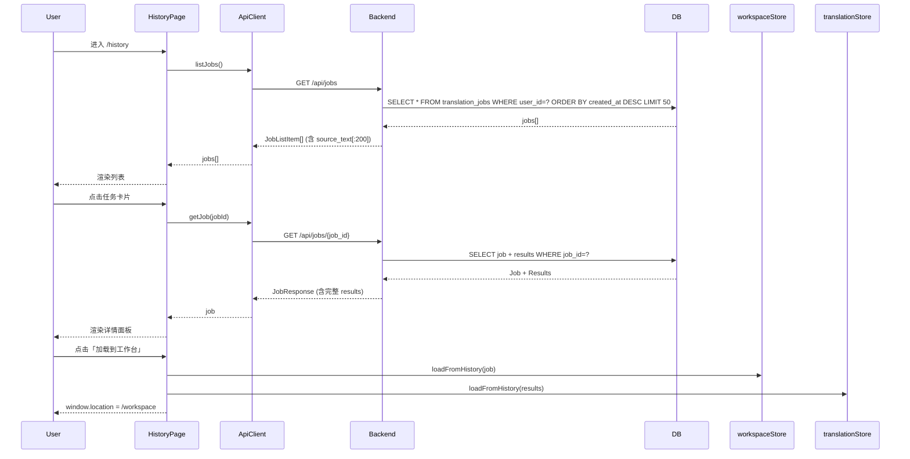

# 翻译历史记录 — 转译任务持久化存储与查看

**日期**: 2026-07-01
**状态**: 设计已确认

## 1. 概述

### 1.1 背景

当前翻译平台已完成一次翻译后，作业 ID 仅存在于 `workspaceStore.currentJobId` 中，一旦用户开始新翻译或刷新页面，之前的翻译任务便无法从 UI 访问。虽然数据库中的 `translation_jobs` 和 `translation_results` 表已完整保存所有历史任务数据，但前端缺少查看和恢复历史任务的能力。

### 1.2 目标

- 提供独立的历史记录页面，列表展示历史翻译任务
- 支持按文体、状态筛选
- 支持查看任务详情（原文、参数、各语言译文概览）
- 支持将历史任务「加载到工作台」以继续审阅/导出
- 支持删除历史任务

### 1.3 非目标

- 关键词搜索（后续按需添加）
- 语言筛选（后续按需添加）
- 分页（当前 50 条限制足够）
- 批量操作（后续按需添加）
- 历史版本对比

## 2. 设计决策

### 2.1 方案选择：独立历史页面 + 工作台顶部最近任务下拉

| 方案 | 决策 |
|---|---|
| 独立历史页面 | 💡 选定 — 遵循现行导航模式（工作台/审校/术语表均为独立页面），提供完整的浏览和管理功能 |
| 工作台侧边栏 |  ❌ 舍弃 — 工作台布局已紧凑（42%/58% 分栏），添加侧边栏会挤占主区域或需手动折叠 |
| 工作台顶部最近任务下拉 | 💡 补充选定 — 轻量快速切换，不破坏布局 |

## 3. 数据库与 API 设计

### 3.1 Schema 变更

`JobListItem` 增加 `source_text` 字段（仅存储原文摘要，后端截断前 200 字符）：

```python
# backend/app/schemas/job.py
class JobListItem(BaseModel):
    id: uuid.UUID
    status: str
    genre: str
    target_languages: list[str]
    source_text: str | None = None       # ← 新增
    created_at: datetime
```

### 3.2 后端 API 变更

| 端点 | 变更 |
|---|---|
| `GET /api/jobs` | 添加 `?genre=xxx&status=xxx` 查询参数过滤；返回 `JobListItem` 增加 `source_text`（截断前 200 字符） |
| `GET /api/jobs/{job_id}` | 无需变更，已返回完整 `JobResponse` |
| `DELETE /api/jobs/{job_id}` | 无需变更 |

不影响现有功能，所有变更向后兼容（新增字段为可选、新增参数为可选）。

### 3.3 后端端点修改

**`GET /api/jobs`** — 添加筛选参数：

```python
@router.get("/api/jobs", response_model=list[JobListItem])
async def list_jobs(
    genre: str | None = Query(None),
    status: str | None = Query(None),
    current_user: User = Depends(get_current_user),
    db: AsyncSession = Depends(get_db),
):
    query = select(TranslationJob).where(TranslationJob.user_id == current_user.id)
    if genre:
        query = query.where(TranslationJob.genre == genre)
    if status:
        query = query.where(TranslationJob.status == status)
    query = query.order_by(TranslationJob.created_at.desc()).limit(50)
    result = await db.execute(query)
    jobs = result.scalars().all()
    return [
        JobListItem(
            id=job.id,
            status=job.status,
            genre=job.genre,
            target_languages=job.target_languages,
            source_text=job.source_text[:200] if job.source_text else None,
            created_at=job.created_at,
        )
        for job in jobs
    ]
```

### 3.4 前端 API Client 新增方法

```typescript
// frontend/lib/api-client.ts
async listJobs(params?: { genre?: string; status?: string }): Promise<JobListItem[]> {
  const searchParams = new URLSearchParams();
  if (params?.genre) searchParams.set("genre", params.genre);
  if (params?.status) searchParams.set("status", params.status);
  const qs = searchParams.toString();
  return this.get(`/api/jobs${qs ? `?${qs}` : ""}`);
}
```

## 4. 前端页面设计

### 4.1 导航入口

在 `(main)/layout.tsx` 顶部导航增加「历史」链接：

```
[工作台]  [审校]  [术语表]  [历史]          ← 新增
```

路由: `(main)/history/page.tsx`

### 4.2 页面布局 — 左右分栏

```
┌─────────────────────────────────────────────────────────┐
│  历史记录                                                │
├───────────────────────┬─────────────────────────────────┤
│  筛选栏                │                                │
│  [文体▼] [状态▼]       │      详情面板                    │
│                       │                                │
│  ┌───────────────────┐│   ← 未选中时显示占位提示          │
│  │ 任务卡片 1         ││      "请选择一条任务查看详情"     │
│  │ 原文摘要...        ││                                │
│  │ 政治 · en-GB       ││                                │
│  │ 2小时前            ││                                │
│  ├───────────────────┤│                                │
│  │ 任务卡片 2         ││                                │
│  └───────────────────┘│                                │
│                       │                                │
└───────────────────────┴─────────────────────────────────┘
```

### 4.3 筛选栏

- **文体筛选**（Dropdown）：全部 / 政治 / 新闻 / 政策 / 品牌
- **状态筛选**（Dropdown）：全部 / 已完成 / 失败 / 进行中
- 筛选变更即时刷新列表

### 4.4 任务卡片

```
┌──────────────────────────────────────────┐
│ ✓ 政治         en-GB  zh-CN              │
│ 本文探讨了中美关系在新时代背景下的...       │
│ 2026-07-01 14:30                          │
└──────────────────────────────────────────┘
```

- 状态图标（✓ 已完成 / ✗ 失败 / ⟳ 进行中）
- 文体 Badge（彩色标签，与工作台一致）
- 目标语言徽标（圆角标签）
- 原文摘要（灰色，截断 80 字符）
- 时间（灰色小字）
- 点击高亮选中

### 4.5 详情面板

```
┌───────────────────────────────────────────────┐
│  翻译详情                                       │
│                                                │
│  📝 原文                                        │
│  ┌───────────────────────────────────────┐     │
│  │ 本文探讨了中美关系在新时代背景下的...   │     │
│  │ （可滚动查看完整原文）                  │     │
│  └───────────────────────────────────────┘     │
│                                                │
│  ⚙️ 参数                                       │
│  文体: 政治 · 策略: 语义对等                      │
│  文化圈: 西方 · 受众: 大众                       │
│                                                │
│  🌐 翻译结果  [全部展开 ▼]                       │
│  ┌─ en-GB ──────────────────────────────────┐  │
│  │ ✓ 已完成 · 风险 3 项 · 评分 85            │  │
│  │ This article explores...                  │  │
│  │ [查看完整译文]                             │  │
│  ├─ zh-CN ──────────────────────────────────┤  │
│  │ ✓ 已完成 · 风险 1 项 · 评分 92            │  │
│  │ 这篇文章探讨了...                          │  │
│  └──────────────────────────────────────────┘  │
│                                                │
│  🔄 [加载到工作台]    🗑️ [删除]    📥 [导出]     │
└───────────────────────────────────────────────┘
```

- **原文区域**：完整原文（可滚动），默认展开
- **参数摘要**：文体、策略、文化圈、受众类型
- **翻译结果列表**：每个语言一个折叠面板，显示状态、风险数、评分、译文摘要（截断 120 字），可展开查看完整译文
- **底部操作栏**：
  - 「加载到工作台」— 主要操作（Primary Button，最左侧，视觉突出）
  - 「删除」— 确认弹窗后删除
  - 「导出」— Dropdown 菜单（.txt / .docx），复用现有的导出逻辑

### 4.6 「加载到工作台」交互流程

```
用户点击「加载到工作台」
  → 跳转 /workspace
  → workspaceStore.loadFromHistory(jobData)
    → input.text = job.source_text
    → input.genre = job.genre
    → input.strategy = job.strategy
    → input.culturalSphere = job.cultural_sphere
    → input.audienceType = job.audience_type
    → languages = job.target_languages
    → currentJobId = job.id
  → translationStore.loadFromHistory(results)
    → 每个 language 创建 LangResult { status, translatedText, riskAnnotations, acceptanceScore, culturalAdaptation }
  → 页面呈现为翻译完成状态
  → 用户可查看/修改译文、处理风险、导出、或重新翻译
```

**边界情况：**
- 如果当前工作台有未完成翻译 → 直接覆盖（无需确认，因为历史任务是已完成状态）
- 如果用户在工作台修改源文本并提交 → 创建新任务，历史记录不变
- 任务状态为 `failed` → 仍可加载，但在工作台显示失败状态，用户可以调整参数后重新翻译

### 4.7 占位状态

| 状态 | 说明 |
|---|---|
| **空状态** | 无历史记录时显示插画 + "还没有翻译记录，开始你的第一次翻译吧" + 「去翻译」按钮链接到工作台 |
| **加载中** | Skeleton 卡片（3 个灰色占位卡片 pulse 动画） |
| **选中未加载** | 右侧面板显示 "请选择一条任务查看详情" 图标提示 |
| **筛选无结果** | "没有符合条件的记录" + 清除筛选按钮 |
| **删除确认** | ConfirmDialog："确定要删除这条翻译记录吗？此操作不可撤销。" |

## 5. 组件结构

```
frontend/app/(main)/history/
├── page.tsx               # 页面入口，加载数据，组合布局
├── components/
│   ├── history-layout.tsx       # 左右分栏布局容器
│   ├── filter-bar.tsx           # 筛选栏（文体 + 状态）
│   ├── task-list.tsx            # 左侧任务列表（含任务卡片）
│   ├── task-card.tsx            # 单条任务卡片
│   ├── detail-panel.tsx         # 右侧详情面板
│   ├── source-text-view.tsx     # 原文展示区域
│   ├── translation-summary.tsx  # 单个语言的结果摘要折叠面板
│   └── history-empty.tsx        # 空状态占位组件
```

### 组件职责

| 组件 | 职责 |
|---|---|
| `page.tsx` | 初始化数据加载、状态管理（已选任务、筛选条件）、协调左右面板 |
| `history-layout.tsx` | CSS Grid 布局容器（左 40% / 右 60%） |
| `filter-bar.tsx` | 两个 Dropdown（文体 + 状态），值变化触发父组件过滤 |
| `task-list.tsx` | 接收过滤后的任务列表，渲染 TaskCard 列表，管理选中状态 |
| `task-card.tsx` | 展示单条任务摘要信息，点击选中/高亮 |
| `detail-panel.tsx` | 接收选中任务完整数据，渲染各区域（原文、参数、翻译结果、操作按钮）|
| `source-text-view.tsx` | 完整原文展示（可滚动区域） |
| `translation-summary.tsx` | 单个语言折叠面板：状态+风险数+评分+译文摘要→展开查看完整译文 |
| `history-empty.tsx` | 空状态/无结果插画与提示 |

## 6. 数据流



## 7. 错误处理

| 场景 | 处理 |
|---|---|
| 列表加载失败 | 显示错误提示 + 重试按钮 |
| 详情加载失败 | 显示错误提示 + 重新选择 |
| 删除失败 | 显示错误 Toast |
| 加载到工作台数据异常 | 跳转工作台后显示 Toast 警告（部分数据可能未加载） |
| 后端返回 401 | ApiClient 自动触发刷新 token，失败则跳转登录 |

## 8. 实施步骤

1. 后端：`JobListItem` 增加 `source_text` 字段
2. 后端：`GET /api/jobs` 增加 `genre`、`status` 筛选参数
3. 后端：`GET /api/jobs` 返回 `source_text`（截断前 200 字符）
4. 前端：`apiClient` 新增 `listJobs()` 方法
5. 前端：创建 `(main)/history/` 目录和组件
6. 前端：实现筛选栏 + 任务列表
7. 前端：实现详情面板
8. 前端：实现「加载到工作台」Store 方法
9. 前端：导航栏增加「历史」链接
10. 前端：空状态 / 加载 / 错误状态处理
11. 测试：后端筛选、前端交互、加载流程
